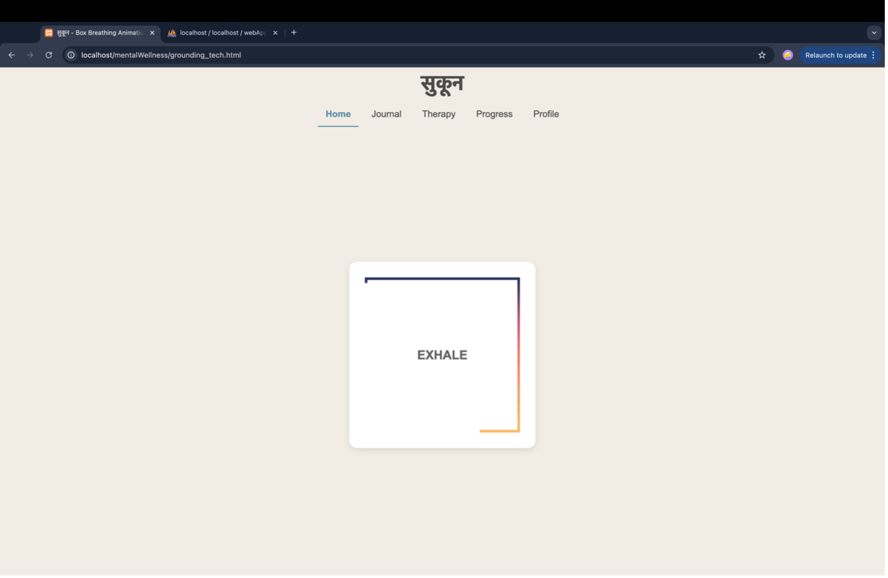

# **सुकून** 🌸  
*A Mental Health and Wellness Application*

Welcome to **सुकून**, a mental health and wellness application aimed at promoting mindfulness, relaxation, and mental well-being. This repository contains the source code and documentation for the Sukoon application.

---

## 📖 Overview  

**सुकून** provides users with tools and resources to manage their mental health effectively. The app is designed with user-friendliness and inclusivity in mind, offering features such as guided meditations, mood tracking, and self-care activities.

---

## 🌟 Features with Screenshots  

### 1. **Home Page**  
The home page serves as the central hub of the app, offering quick access to all the main features. It greets the user with a clean and minimalistic interface designed to promote calmness. From here, users can navigate to their journal, manifestation board, therapy options, and more.  

  

---

### 2. **Grounding Techniques**  
Grounding techniques help users manage anxiety by focusing on the present moment. The app provides easy-to-follow, scientifically-backed exercises aimed at calming the mind.  

  

---

### 3. **Manifestation Board**  
The manifestation board is a digital space where users can visualize and set personal goals. It helps users stay focused on what they want to achieve, offering an interactive way to manifest dreams and track progress.  

- **Empty State**: When the user hasn’t added any goals yet.  
    

- **Filled State**: A populated manifestation board showing user goals.  
    

---

### 4. **Therapy Categories**  
This section offers a comprehensive catalog of therapy options for users. They can search for therapies tailored to their needs and start guided sessions directly within the app.  

- **Search Therapy Categories**:  
    

- **Therapy Sessions**:  
    

---

### 5. **Wellness Check-ins**  
Wellness check-ins allow users to reflect on their mental state through daily self-assessments. Based on the user’s inputs, the app calculates a wellness score, providing insights into their mental health journey over time.  

- **Check-in Page**: Users answer a few quick questions to rate their current mood and mental state.  
    

- **Wellness Score**: Displays a summary of wellness data and progress over time.  
    

---

### 6. **Daily Journaling**  
The journaling feature allows users to document their daily thoughts and emotions. This helps in self-reflection and promotes emotional well-being by encouraging consistent writing habits.  

  

---

### 7. **Progress Tracking**  
Progress tracking provides users with visual insights into their mental health journey. Users can see how their wellness score and habits evolve over time, fostering motivation and self-awareness.  

  

---

### 8. **Interactive Profile**  
The profile page allows users to personalize their experience. Users can update their avatar, view account details, and access personal preferences.  

  

---

### 9. **Self-Reflection Questions**  
A set of thoughtfully designed self-reflection prompts help users dive deeper into their emotions and gain clarity about their thoughts and feelings.  

  

---

### 10. **Authentication Pages**  
Authentication pages enable users to securely log in or sign up to access their personalized mental health journey.  

- **Login Page**: Provides a clean and secure login experience for returning users.  
    

- **Sign-up Page**: Helps new users create an account and get started.  
    

---

## 🚀 Getting Started  

### Prerequisites  

Ensure you have the following installed:  
- [Flutter SDK](https://flutter.dev/docs/get-started/install)  
- A compatible code editor (e.g., VS Code, Android Studio).  

### Installation  

1. Clone the repository:  
   ```bash  
   git clone https://github.com/bhuvyas13/Sukoon.git  
   cd Sukoon  
   ```  

---

## 💻 Technology Stack  

- **Frontend & Backend**: Flutter  
- **State Management**: Provider  
- **Database**: Firebase  

---

## 🛠️ Project Highlights  

- **User-Centric Design**: Clean, aesthetic UI crafted with attention to detail.  
- **Holistic Approach**: Combines traditional practices with modern therapy techniques.  
- **Performance Optimized**: Swift and smooth navigation throughout the app.  

---

## 🙌 Contributions  

We welcome contributions from the community! Feel free to fork the repository, create a branch, and open a pull request. Please check the [Contributing Guidelines](CONTRIBUTING.md) for more details.  

---


## 📞 Contact  

For any queries or suggestions:  
- **Author**: Bhuvyas S.  
- **GitHub**: [bhuvyas13](https://github.com/bhuvyas13)  

---

### ✨ Thank you for using **सुकून**!  
Feel free to share your feedback and contributions.  

---
